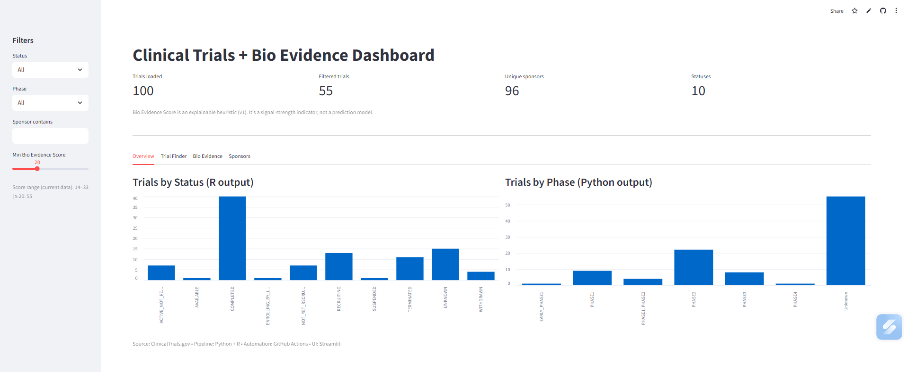
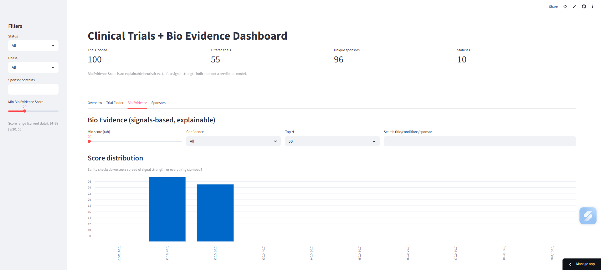
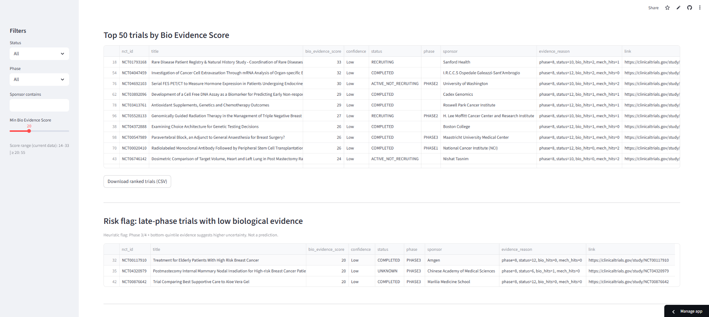

# 🧬 Clinical Trials + Bio Evidence Intelligence Dashboard

A **live, end-to-end analytics dashboard** that combines public clinical trial metadata with an **explainable biological evidence scoring system** to support **early risk assessment, prioritization, and signal discovery** in drug development.

🔗 **Live App:** https://trial-bio-intel.streamlit.app/  
📦 **GitHub Repo:** https://github.com/aparna32/trial-bio-intel-dashboard

---

## 🎯 Project Objective

Clinical trials fail expensively and often late. This project explores a practical question:

> **Can early biological signals (from trial descriptions and metadata) be used to flag risk, prioritize trials, and surface promising candidates — before outcomes are known?**

This dashboard is **not a prediction model**. It is an **explainable signal-strength heuristic** designed for:
- Research analysts  
- Clinical strategy teams  
- Bioinformatics & translational science roles  
- Risk / portfolio intelligence use cases  

---

## 🧠 What This Dashboard Does

### 1. Fetches & processes live trial data
- Source: **ClinicalTrials.gov**
- Automated via **Python + R pipeline**
- Weekly refresh using **GitHub Actions**

### 2. Computes a Bio Evidence Score (0–100)
Each trial receives a score based on:
- Trial phase (later phase = higher weight)
- Recruitment status
- Biological & mechanistic keywords in:
  - Title
  - Conditions
  - Intervention descriptions  

The score is:
- Fully explainable  
- Deterministic (no black-box ML)
- Designed for analyst interpretation  

### 3. Interactive exploration
- Filter by status, phase, sponsor, score
- Rank trials by biological signal
- Identify:
  - ⚠️ Late-phase trials with weak evidence
  - 👀 High-signal recruiting trials
  - 🧪 Sponsors with concentrated activity

---

## 📊 Dashboard Sections

### 🔹 Overview
- Trials by **status** (R-generated summary)
- Trials by **phase**
- High-level KPIs

### 🔹 Trial Finder
- Fully filterable table
- Direct links to ClinicalTrials.gov
- CSV export of filtered results

### 🔹 Bio Evidence (Core Feature)
- Score distribution visualization
- **Top-N trials by evidence**
- **Risk Flag:** Phase 3/4 + low evidence
- **Watchlist:** High-signal + Recruiting + Phase 2/3
- Dynamic thresholds based on data percentiles

### 🔹 Sponsors
- Top sponsors based on current filters
- Useful for portfolio & landscape analysis

---

## 📷 Screenshots

### Overview Dashboard


### Bio Evidence – Score Distribution


### Bio Evidence – Risk Flags & Watchlist



---

## 🏗️ Tech Stack

**Frontend**
- Streamlit
- Pandas / NumPy

**Data Pipeline**
- Python (data ingestion, cleaning)
- R (status aggregation, scoring logic)
- CSV handoff for transparency

**Automation**
- GitHub Actions (weekly refresh)
- GitHub Codespaces (development)

---

## 🔬 Bio Evidence Score — How It Works

The score is a **heuristic signal**, not a prediction.

**Components:**
- Phase weight  
- Status weight  
- Keyword evidence:
  - Biological terms (e.g. gene, RNA, biomarker)
  - Mechanistic terms (e.g. inhibitor, antibody)

**Why this matters:**
- Late-stage trials with weak biological grounding are risky
- Early-stage trials with strong mechanistic clarity deserve attention
- This mirrors real-world biotech portfolio discussions

---

## ▶️ Run Locally

```bash
git clone https://github.com/aparna32/trial-bio-intel-dashboard
cd trial-bio-intel-dashboard

pip install -r requirements.txt

# Optional: regenerate data
python scripts_py/01_fetch_trials.py
Rscript scripts_r/02_bio_evidence_score.R

# Launch dashboard
streamlit run dashboard/app.py
```

---

## 🧱 Project Architecture

```mermaid
flowchart TD
  A[ClinicalTrials.gov] --> B[Python: scripts_py/01_fetch_trials.py]
  B --> C[data_processed/trials_clean.csv]
  C --> D[R: scripts_r/02_bio_evidence_score.R]
  D --> E[data_processed/trial_bio_evidence.csv]
  C --> F[Streamlit: dashboard/app.py]
  E --> F
  G[GitHub Actions (weekly)] --> B
  G --> D

